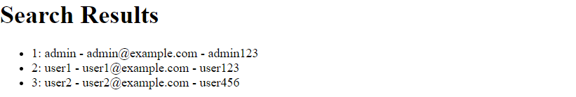

## Protecting Against SQL Injection Attacks

### Introduction:

In Django web applications, SQL injection poses a significant security risk. This vulnerability occurs when user input is directly embedded into SQL queries without proper filtering or validation, allowing attackers to manipulate the queries and potentially gain unauthorized access to the database.

This documentation illustrates an example of an SQL injection vulnerability in a Django view and demonstrates how to mitigate it using Django's ORM and parameterized queries.

### Database
To demonstrate SQL injection vulnerabilities, a MySQL database named "my_database" was created to manage user information within the application. This database includes a table named "users," designed to store user account details such as usernames, email addresses, and passwords.

MySQL was selected as the database management system due to its widespread usage, robust performance, and comprehensive features. Its compatibility with Django and seamless integration capabilities make it an ideal choice for storing and managing application data securely.

Throughout this demonstration, MySQL serves as the underlying database engine, facilitating the exploration and mitigation of SQL injection vulnerabilities within Django web applications.

**1. Creating the "users" table:**
```sql
CREATE TABLE IF NOT EXISTS users (
    id INT AUTO_INCREMENT PRIMARY KEY,
    username VARCHAR(50) NOT NULL,
    email VARCHAR(100) NOT NULL,
    password VARCHAR(255) NOT NULL
);
```
**2. Structure of the table "users"**

```sql
DESCRIBE users;

+----------+--------------+------+-----+---------+----------------+
| Field    | Type         | Null | Key | Default | Extra          |
+----------+--------------+------+-----+---------+----------------+
| id       | int          | NO   | PRI | NULL    | auto_increment |
| username | varchar(50)  | NO   |     | NULL    |                |
| email    | varchar(100) | NO   |     | NULL    |                |
| password | varchar(255) | NO   |     | NULL    |                |
+----------+--------------+------+-----+---------+----------------+
```

**3. Inserting data into the "users" table**
```sql
INSERT INTO users (username, email, password) VALUES
('admin', 'admin@example.com', 'admin123'),
('user1', 'user1@example.com', 'user123'),
('user2', 'user2@example.com', 'user456');
```

**4. View the data in the "users" table**

```sql
SELECT * FROM users;
+----+----------+-------------------+----------+
| id | username | email             | password |
+----+----------+-------------------+----------+
|  1 | admin    | admin@example.com | admin123 |
|  2 | user1    | user1@example.com | user123  |
|  3 | user2    | user2@example.com | user456  |
+----+----------+-------------------+----------+
```

### Django User Search Documentation

This Django application is designed to manage users and their data using a MySQL database. It provides a user-friendly interface to view, add, update, and delete user records.
Set up and installation steps:

1. Install Django and the MySQL database adapter:
```bash
pip install django mysqlclient
```
2. Create a new Django project and application:
```bash
django-admin startproject myproject
cd myproject
python manage.py startapp myapp
```
   
3. Configure the MySQL database connection in the project's settings.py file:
```python
DATABASES = {
    'default': {
        'ENGINE': 'django.db.backends.mysql',
        'NAME': 'my_database',  
        'USER': 'root',     
        'PASSWORD': 'password', 
        'HOST': 'localhost',    
        'PORT': '3306',         
    }
}
```

4. Define a model for the user table in the myapp/models.py file:
```python
from django.db import models

class User(models.Model):
    username = models.CharField(max_length=50)
    email = models.EmailField(max_length=100)
    password = models.CharField(max_length=255)

    def __str__(self):
        return self.username
```

5. Create migrations to apply the model changes to the database:
```bash
python manage.py makemigrations
python manage.py migrate
```

#### Implementation

This Django application provides functionality to search for users in a database. It includes both vulnerable and protected versions of user search functionality to demonstrate the importance of protecting against SQL injection attacks.

**Vulnerable View**

This view directly constructs an SQL query using user input without proper validation or sanitization. Here's how it works:

* When a POST request is received, the view extracts the search query from the request.

* The search query is then concatenated into an SQL query string using string formatting.

* The constructed SQL query is executed directly against the database using Django's connection.cursor() method.

* The query results are fetched, and the user data is returned to the template for rendering.

This approach is vulnerable to SQL injection attacks because user input is directly embedded into the SQL query string without any validation or parameterization.

Let's examine a vulnerable Django view that directly uses SQL queries without proper validation:

```
from django.db import connection

def search_users1(request):
    if request.method == 'POST':
        search_query = request.POST.get('search_query')
        cursor = connection.cursor()
        cursor.execute("SELECT * FROM my_database.users WHERE username LIKE '%" + search_query + "%'")
        users = cursor.fetchall()
        return render(request, 'search_results.html', {'users': users})
    else:
        return render(request, 'search_users.html')
```
In this vulnerable view, the user's search query is directly concatenated into the SQL query string using string formatting. This approach leaves the application susceptible to SQL injection attacks because the user input is not properly sanitized or validated.

**Secure Approach with Django ORM**

This view utilizes Django's ORM to perform the user search operation in a secure manner. Here's how it works:

* When a POST request is received, the view extracts the search query from the request.

* The search query is used to construct a parameterized query using Django's ORM. Specifically, the filter method is used to construct a LIKE query that filters users based on the search query.

* The constructed query is executed against the database using Django's ORM, ensuring that user input is properly sanitized and validated.

* The query results are returned to the template for rendering.

This approach mitigates SQL injection vulnerabilities by leveraging Django's ORM, which automatically parameterizes queries and prevents malicious manipulation of SQL commands.

```
from .models import User

def search_users2(request):
    if request.method == 'POST':
        search_query = request.POST.get('search_query')
        users = User.objects.filter(username__icontains=search_query)
        return render(request, 'search_results.html', {'users': users})
    else:
        return render(request, 'search_users.html')

```
In this secure view, we utilize Django's ORM to perform the database query. The filter method is used to construct the SQL query, and Django automatically handles parameterization, ensuring that user input is properly sanitized. This approach significantly reduces the risk of SQL injection vulnerabilities.

### Security Considerations

The 'search_users_info_vulnerable' view is susceptible to SQL injection attacks due to direct SQL query construction.
The 'search_users_info_protected' view uses Django's ORM, which provides protection against SQL injection by parameterizing queries.
It is recommended to always use parameterized queries or Django's ORM for database operations to prevent SQL injection vulnerabilities.

### HTML Templates Documentation

**search_users.html**
1. This HTML template represents the user search form.
2. It contains a form where users can enter a username to search for.
3. The form uses the POST method to submit the search query.
4. A CSRF token is included for security.
5. The input field has the name "search_query" and a placeholder text "Enter username".
6. A submit button allows users to initiate the search.

**search_results.html**
1. This HTML template displays the search results.
2. It shows a header with the title "Search Results".
3. Inside an unordered list (ul), it iterates over each user in the 'users' context variable.
4. For each user, it checks if the 'id' attribute exists.
   * If the 'id' attribute exists, it displays the user's id, username, email, and password.
   * If the 'id' attribute doesn't exist, it assumes that the user object is returned as a tuple and displays its elements accordingly.
5. If no users are found (the 'users' variable is empty), it displays a message "No users found" within a list item (li).
6. This template is used to render the search results returned by both the vulnerable and protected search views.

### Request and Search Results:

Upon receiving a search query "admin", the view executes a secure database query to retrieve user information matching the specified criteria.

**Request**


**Search Results**


The search query "admin" is processed by the view to search for users in the database. The query returns a single result corresponding to the username "admin". Subsequently, the user's information, including their email address and password, is presented.


### SQL Injection (SQLi) Overview

SQL Injection (SQLi) is a type of security vulnerability commonly found in web applications that interact with a database. It occurs when attackers manipulate input data to execute unintended SQL commands, leading to unauthorized access to the database and potentially compromising the application's security.

#### 1. In-band SQL Injection
In-band SQL Injection is the most common type, where attackers use the same channel to send malicious SQL queries and receive results. By injecting SQL commands into input fields, attackers can manipulate database queries to retrieve, modify, or delete sensitive information.

_**In-band SQL Injection Example**_: 
An attacker injects SQL code like `' OR 1=1;--` into a login form's username field.
The entered search string is directly inserted into the SQL query without validation or sanitization. Consequently, the SQL query becomes: `SELECT * FROM my_database.users WHERE username LIKE '%\' OR 1=1;--%'`.
The injected SQL code `OR 1=1` always evaluates to true, causing the query to return all records from the users table, regardless of the search query. As a result, the attacker gains unauthorized access to sensitive user data.

#### 2. Blind SQL Injection
Blind SQL Injection occurs when attackers do not receive direct feedback from the application about the success of their injected SQL commands. Instead, attackers rely on observing differences in the application's behavior to infer the success or failure of the injection. This type of attack can be time-based or boolean-based.

_**Blind SQL Injection Example:**_
The attacker submits the crafted input containing the payload into the vulnerable input field.
The application processes the input and executes the SQL query, resulting in a delay caused by the _pg_sleep(10)_ function.
By observing the application's response time, the attacker can infer the success of the injection based on the presence of the delay.
If the delay occurs as expected, the attacker concludes that the SQL Injection was successful, indicating potential vulnerabilities in the application's security defenses.


#### 3. Out-band SQL Injection
Out-of-band SQL Injection is similar to in-band SQL Injection, but attackers use a separate communication channel to extract data from the database. This can involve techniques such as DNS or HTTP requests to obtain the results of the injected SQL commands, making detection more challenging.

_**Out-of-band SQL Injection Example:**_
The injection point is the input field where the attacker inserts the malicious SQL code.
The injected SQL code `' UNION SELECT * FROM users;--` chanhes the original query to perform a UNION operation with the _users_ table, potentially revealing sensitive information.

As a result, the application executes an out-of-band action, such as triggering an HTTP request to a controlled server set up by the attacker.
By monitoring the logs or responses from the controlled server, the attacker indirectly obtains the results of the injected SQL query, gaining access to sensitive information from the database.

### Comparison of Results

**Vulnerable View Result:**



**Secure View Result:**


### Conclusion:

SQL Injection (SQLi) is a critical security vulnerability that poses significant risks to web applications interacting with databases. In-band, Blind, and Out-of-band SQL Injection attacks exploit weaknesses in input validation and SQL query construction, allowing attackers to execute unauthorized SQL commands and access sensitive data.

In-band SQL Injection, the most common type, involves attackers directly manipulating input fields to inject malicious SQL code, leading to immediate access to sensitive information. Blind SQL Injection, on the other hand, relies on observing differences in application behavior to infer the success of injected SQL commands, making detection more challenging. Out-of-band SQL Injection utilizes separate communication channels, such as DNS or HTTP requests, to extract data from the database indirectly, further complicating detection efforts.

To mitigate SQL Injection vulnerabilities, web developers should employ defensive coding practices such as input validation, parameterized queries, and the use of ORM frameworks like Django's ORM. These measures help prevent malicious exploitation of SQL vulnerabilities and ensure the security and integrity of web applications.


